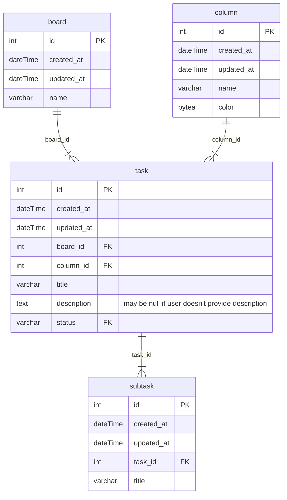

# Kanban Task Manager

App for task management

## Workspaces

### 💚 Backend

- [Nest.js](https://nestjs.com/) — A Backend framework based on Node.js
- [Prisma](https://www.prisma.io/) — Typescript-oriented ORM

### 💛 Frontend

- [React](https://react.dev/) - The Frontend library based on Javascript
- [Redux Toolkit](https://redux-toolkit.js.org/) - A state manager
- [Redux Toolkit Query](https://redux-toolkit.js.org/rtk-query/overview) - addon for Redux Toolkit for caching and fetching data
- [Styled Components](https://styled-components.com/) - library for writing CSS in JS while building components in React

### 💙 Shared

- [Zod](https://zod.dev/) - Typescript-oriented validation

## Code Quality
- CSS:
  - 🎨 [stylelint](https://stylelint.io/) - CSS-linter
- Stylelint rules:
  - 🩳 [stylelint-config-standard](https://github.com/stylelint/stylelint-config-standard) - Default rules for stylelint
- Files and directories
  - 📁 [ls-lint](https://ls-lint.org/) - Files or directories linting
- JS:
   - 🔥 [ESLint](https://eslint.org/) - Javascript-linter
- ESLint Rules:
   - 💀 [eslint:recommended](https://eslint.org/docs/latest/rules/) - Default ESLint rules
   - 💀 [eslint-plugin-sonarjs](https://github.com/SonarSource/eslint-plugin-sonarjs) - SonarJS rules for ESLint to detect bugs and suspicious patterns in your code
   - 🔏 Typescript:
     - 💀 [typescript-eslint:recommended](https://typescript-eslint.io/linting/configs/#recommended) - Default Typescript rules
     - 💀 [typescript-eslint:recommended-requiring-type-checking](https://typescript-eslint.io/linting/configs/#recommended-requiring-type-checking) - Addition Typescript rules that require type information
     - 💀 [typescript-eslint:strict](https://typescript-eslint.io/linting/configs/#strict) - Additional Typescript rules  that can also catch bugs but are more opinionated than recommended rules
   - 🔤 Naming:
     - 🦄 [eslint-plugin-unicorn](https://github.com/sindresorhus/eslint-plugin-unicorn) - More than 100 powerful ESLint rules (including more consistent naming patterns)
     - 💀 [eslint-plugin-function-name](https://www.npmjs.com/package/eslint-plugin-function-name) - Rules for naming functions
   - 🔢 Sorting:
     - 💀 [eslint-plugin-import](https://github.com/import-js/eslint-plugin-import), [eslint-plugin-simple-import-sort](https://github.com/lydell/eslint-plugin-simple-import-sort) - Rules for sorting imports in code
     - 💀 [eslint-plugin-typescript-sort-keys](https://github.com/infctr/eslint-plugin-typescript-sort-keys) - Rules for sorting keys in interfaces
  - ⚛️ Client:
    - 💀 [eslint-plugin-react](https://github.com/jsx-eslint/eslint-plugin-react) - Linting for React
    - 💀 [eslint-plugin-react-hooks](https://www.npmjs.com/package/eslint-plugin-react-hooks) - Plugin which enables "Rules of Hooks" in React
    - ✌️ [eslint-plugin-jsx-a11y](https://github.com/jsx-eslint/eslint-plugin-jsx-a11y) - Accessibility rules in React

- Commits:
   - 🤝 [commitlint](https://commitlint.js.org/#/) - Commits-linter
   - 🐶 [husky](https://typicode.github.io/husky/) - Tool for managing git hooks
- Git staged files:
   - 💣 [lint-staged](https://github.com/okonet/lint-staged) - Linting git staged filed
- Code formatting:
   - 🎀 [Prettier](https://prettier.io/) - Code formatting

## Database schema

## Application Schema

Soon

## Local setup

Soon
