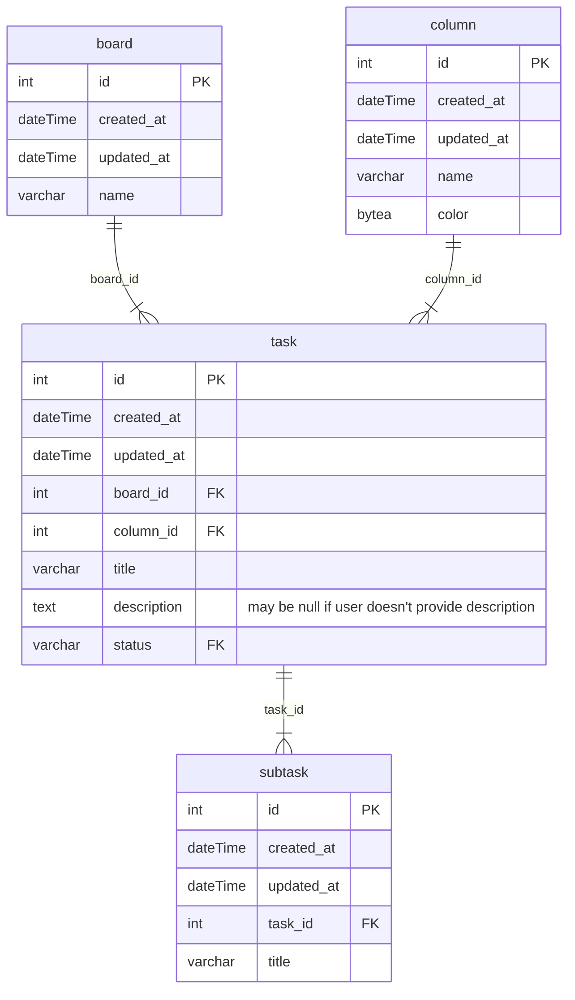

# Kanban Task Manager

App for task management

## Workspaces

### 💚 Backend

- [Nest.js](https://nestjs.com/) — A Backend framework based on Node.js
- [Prisma](https://www.prisma.io/) — Typescript-oriented ORM

### 💛 Frontend

- [React](https://react.dev/) - The Frontend library based on Javascript
- [Redux Toolkit](https://redux-toolkit.js.org/) - A state manager
- [Redux Toolkit Query](https://redux-toolkit.js.org/rtk-query/overview) - addon for Redux Toolkit for caching and fetching data

### 💙 Shared

- [Zod](https://zod.dev/) - Typescript-oriented validation

## Code Quality

Soon

## Database schema

Soon

## Application schema

Soon

## Local setup

Soon
